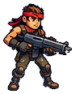

# Diamond Heroes - PNG Asset Pack

Extracted from your supplied 1536 x 1024 reference board. No additional characters, poses, or hidden background details were generated.

## Start here

1. Open this folder in VS Code.
2. Open `preview.html` in a browser to browse, filter, and inspect every asset. It works directly from disk; no installation or web server is required.
3. Have Claude read `CLAUDE.md` and `assets.json` before building or changing your game. Use the individual files in `assets/`, not the entire reference board as a game screen.

## What is included

| Category | Individual PNGs | Contents |
| --- | ---: | --- |
| Characters | 9 | Assault, Tank, Scout; Goblin, Sniper, Robot, Flying Drone, Dark Colossus; a tiny companion pose |
| Weapons | 9 | Pistol, Shotgun, Assault Rifle, Sniper Rifle, Rocket Launcher, Sword; 3 shop variants |
| Items | 9 | Diamond, Health Pack, Ammo Box, Power Up, Shield, Key; 3 ammo icons |
| Portraits | 5 | 3 hero bust crops, assault inventory portrait, companion portrait |
| Interface | 90 | Buttons, controls, icons, bars, cards, inventory tiles, map nodes, dialogue, settings |
| Branding | 1 | Diamond Heroes logo |
| Screen and sheet references | 18 | 13 complete screen crops and 5 original labeled asset strips |

There are **123 individual asset PNGs**, **18 reference crops**, and the original overview image. A second set of **123 4x-enlarged PNGs** is provided under `upscaled-4x/`. The visual contact sheet is an additional preview, not another sprite.

## Folder structure

```text
diamond-heroes-assets/
  README.md
  CLAUDE.md
  assets.json                  Asset manifest, sizes, paths, pivots and quality notes
  asset-catalog.csv             Searchable inventory
  preview.html                 Browser asset viewer
  assets/
    characters/
      heroes/                  assault.png, tank.png, scout.png
      enemies/                 goblin.png, sniper.png, robot.png, ...
      companion/               companion_idle_small.png
    weapons/                   6 main weapon PNGs
      variants/                3 shop drawings
    items/                     Pickups and ammo
    portraits/
    ui/
      buttons/  controls/  icons/  rewards/  labels/  bars/  hud/
      cards/  inventory/  map/  dialogue/  settings/
    branding/
  upscaled-4x/assets/           Same asset folder structure, enlarged 4x
  references/
    source-overview.png
    screens/                   Complete flattened screen crops
    sheets/                    Original labeled sprite strips
  previews/
    core-assets.png
  tools/
    export_assets.py           Optional reproducible crop/masking exporter
    extraction-config.json    Original crop coordinates and extraction settings
    requirements.txt
```

## Important limits of this source

**Resolution.** The board is a flattened image, not the original art project. Most full-body heroes contain roughly 80-110 pixels of actual source detail across their height. Weapons and icons are smaller. The 4x versions are Lanczos enlargements, not new high-resolution artwork. Use the native files for small UI and prototypes; inspect edges before printing or displaying very large.

**Transparency.** Standalone characters, weapons, pickups, logo, and many UI icons have transparent surroundings. Buttons retain their original dark/colored faces. Portrait crops intentionally keep their backgrounds. A checkerboard appears only in previews; it is not baked into the transparent asset files.

**Incomplete or approximate art.** The companion full-body pose is extremely small and was extracted from a busy scene. Its edge mask is approximate and may retain a little edge contamination. Prefer `assets/portraits/companion.png` for dialogue. Map nodes and the map boss marker also come from illustrated backgrounds; consult each asset's `quality` and `notes` fields. HUD snapshots retain their current numbers and may retain nearby scene pixels.

**No hidden layers.** Characters' held guns are baked into their poses. The source does not contain separate arms, faces, rigged body parts, walking cycles, projectiles, or complete unseen surfaces. These are static images, not animation sprite sheets.

**No clean full-scene backgrounds.** `references/screens/` contains the original scenes with characters, interface, labels, and other overlays still visible. Do not treat these crops as empty gameplay backgrounds or assume covered scenery has been restored.

**Baked text and values.** Text on button images, cards, dialogue boxes, progress-bar states, and complete screens is not independently editable. For changing labels or numbers, recreate the text and value display using HTML/CSS/canvas. Use the PNGs as visual references or static skins.

**Pivots.** Manifest pivots are convenient geometric center or bottom-center defaults, not artist-verified animation pivots or collision boxes. Define collision boxes separately in the game.

## Using an individual asset

```html

```

```js
// Relative paths work when the game is served from this pack's root.
const hero = new Image();
hero.src = "assets/characters/heroes/assault.png";
hero.onload = () => {
  console.log("Hero loaded:", hero.naturalWidth, hero.naturalHeight);
};
hero.onerror = () => console.error("Hero asset could not be loaded.");
```

For a canvas renderer, subtract `pivotPixels` from the desired draw anchor. If displaying an enlarged file at its original logical size, use the native manifest width and height as its rendered dimensions.

## Suggested first request for Claude

> Read CLAUDE.md and assets.json. Build my game using the individual PNGs under assets/. Keep references/ as visual guidance only. Use editable HTML/CSS text for labels, stats, and dialogue. Preserve image proportions, load assets safely, and list missing animation or clean-background assets instead of pretending they are included. Start by showing the heroes, weapons, inventory, and basic movement with the supplied static poses.

## Optional: adjust and repeat the extraction

The PNGs are ready to use; this step is not required. To change crop bounds or mask settings, edit `tools/extraction-config.json`, then run from the pack root:

```sh
python -m pip install -r tools/requirements.txt
python tools/export_assets.py
```

To export into a separate folder without replacing these PNGs:

```sh
python tools/export_assets.py --output ./re-extracted
```

The exporter regenerates PNGs and the manifest. It does not regenerate this README or the embedded data in the browser preview. All file paths inside the manifest are relative to the output folder.

## Rights

This pack was made from the image you supplied. It does not add an independent license or guarantee third-party rights to the depicted artwork.
